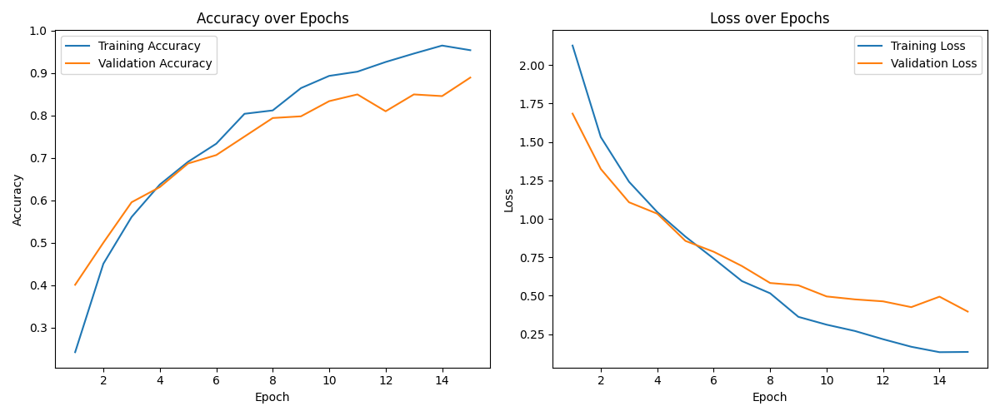
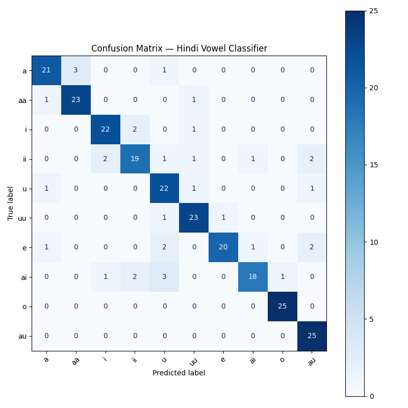

# Hindi Handwritten Vowel Recognizer

An end-to-end machine learning project that recognizes handwritten Devanagari (Hindi) vowels using a custom CNN, built entirely from scratch which includes data created with hand and then used for the project.

---

## Demo

Draw any Hindi vowel on the canvas and the model predicts it in real time.

> Run locally with: `streamlit run app.py`

---

## Project Overview

Most handwriting recognition projects use existing public datasets. This project takes a different approach where every image was handwritten, scanned, and labeled manually by the project author and a second writer, making it a genuine end-to-end data science project rather than a model-training exercise.

**Characters recognized:** अ आ इ ई उ ऊ ए ऐ ओ औ (10 Hindi vowels)

---

## Pipeline
Raw handwriting (pen on paper)

↓

Scanned at 300 dpi (flatbed scanner)

↓

crop_sheets.py — auto-detects grid boundaries, crops 63 cells per sheet

↓

preprocess.py — grayscale conversion, 64×64 resize, normalization

↓

train_model.py — CNN training (TensorFlow/Keras)

↓

evaluate_model.py — confusion matrix, classification report

↓

app.py — live Streamlit demo

---

## Dataset

| Property | Details |
|---|---|
| Total images | 1,260 |
| Characters | 10 Hindi vowels |
| Writers | 2 (Navnee, Mom) |
| Samples per character | ~63 per writer |
| Image size (processed) | 64×64 px grayscale |
| Collection method | Handwritten on printed grid, scanned at 300 dpi |

---

## Model Architecture

Input (64×64×1)

→ Conv2D (32 filters, 3×3, ReLU)

→ MaxPooling2D (2×2)

→ Conv2D (64 filters, 3×3, ReLU)

→ MaxPooling2D (2×2)

→ Flatten

→ Dense (128, ReLU)

→ Dropout (0.3)

→ Dense (10, Softmax)

**Total parameters:** 1,625,866

---

## Results

| Metric | Value |
|---|---|
| Training Accuracy | 91% |
| Validation Accuracy | 87% |
| Test samples | 252 |
| Strongest classes | ओ, औ (near-perfect) |
| Weakest classes | उ, ई, ऐ, ए |

### Training Curves


### Confusion Matrix


---

## Key Findings from Evaluation

- **ओ and औ** were the strongest-performing classes with near-perfect precision and recall, their shapes are visually distinctive enough that the model rarely confuses them
- **उ, ई, ऐ, ए** showed the most inter-class confusion — these characters share visual curve and loop patterns in natural handwriting, a finding consistent across both formal evaluation and live testing
- **Domain shift** was observed between scanned training data (thin pen strokes, white background) and live canvas drawing (digital strokes, black background)

---

## Challenges & Solutions

### 1. Grid margin causing cut-off crops
**Problem:** The initial cropping script divided the full scanned image equally, but the printed grid had margins — causing edge cells to be half-margin, half-character.  
**Fix:** Precisely measured grid boundary coordinates from the printed template using pixel-level analysis, then hardcoded accurate crop boundaries.

### 2. Positional bias in live predictions
**Problem:** The model gave different predictions for the same character depending on where it was drawn on the canvas.  
**Root cause:** Training images were always tightly cropped and centered. The model implicitly learned position as a feature.  
**Fix:** Added a bounding-box detection step before inference, live drawings are auto-cropped to the stroke region, padded, squared, and centered before being fed to the model.

### 3. Aspect ratio distortion
**Problem:** After fixing position, the bounding-box crop wasn't always square, resizing a non-square crop to 64×64 stretched characters differently depending on their natural proportions.  
**Fix:** Padded the shorter dimension to make every crop square before resizing — preventing shape distortion regardless of how the character was drawn.

### 4. TensorFlow crash on Apple Silicon
**Problem:** The generic `tensorflow` pip package caused low-level mutex crashes on an M-series Mac.  
**Fix:** Switched to `tensorflow-macos`, the Apple Silicon-optimized build.

---

## How to Run Locally

```bash
# Clone the repo
git clone https://github.com/yourusername/hindi-vowel-recognizer.git
cd hindi-vowel-recognizer

# Create virtual environment
python3.9 -m venv venv
source venv/bin/activate

# Install dependencies
pip install opencv-python numpy tensorflow-macos scikit-learn matplotlib streamlit streamlit-drawable-canvas

# Train the model (requires dataset — see Dataset section)
python train_model.py

# Run the Streamlit app
streamlit run app.py
```

> **Note:** `tensorflow-macos` is required for Apple Silicon Macs. For other systems, use standard `tensorflow`.

---

## Tech Stack

| Tool | Purpose |
|---|---|
| Python 3.9 | Core language |
| OpenCV | Image processing, grid detection, cropping |
| TensorFlow / Keras | CNN model building and training |
| NumPy | Array operations |
| scikit-learn | Train/test split, confusion matrix, classification report |
| Matplotlib | Training curves visualization |
| Streamlit | Live demo web app |

---

## Next Steps

The immediate priority is expanding the dataset. The current model is trained on 2 writers (63 samples per character each), which limits generalization particularly for visually similar vowels like उ, ऐ, and ए. Collecting handwriting from additional writers, with a focus on these weaker classes, is expected to meaningfully improve both validation accuracy and live inference performance.

Beyond data collection, the longer-term roadmap includes extending the project from single-character recognition to full **Hindi word recognition** detecting and segmenting multiple characters within a single word image, then classifying each using the existing CNN pipeline.
